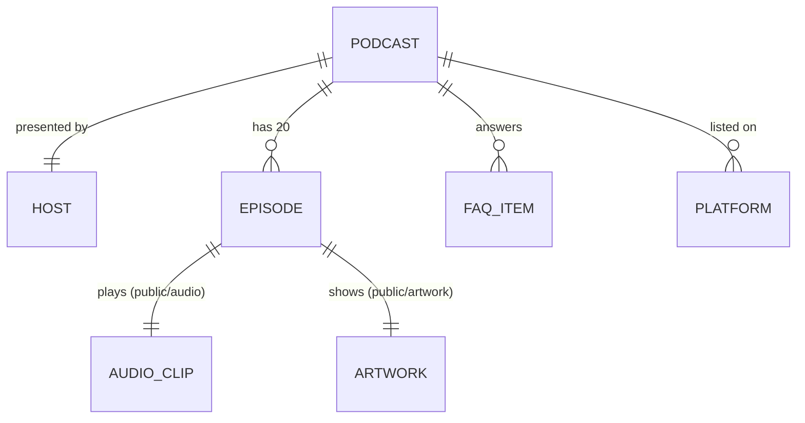

# Data Model: Modern Podcast Website

**Feature**: 001-podcast-website | **Date**: 2026-10-07

All data is static, embedded as typed TypeScript modules under `content/` and consumed at build
time. There is no persistence layer and no runtime mutation; the only client-side state is the
visitor's theme preference (browser `localStorage`) and transient audio playback state.

## Entities

### Podcast

Singleton describing the show.

| Field | Type | Rules |
|-------|------|-------|
| `name` | string | required, 1–60 chars |
| `tagline` | string | required, ≤ 120 chars |
| `introduction` | string | required; shown on About |
| `mission` | string | required; shown on About |

### Host

Singleton describing the presenter.

| Field | Type | Rules |
|-------|------|-------|
| `name` | string | required |
| `photoSrc` | string | required; path under `/public`, file must exist (implemented as `/host.svg`, an illustrated avatar) |
| `photoAlt` | string | required, non-empty |
| `bio` | string | required, ≤ 600 chars |

### Episode

One of exactly 20 installments.

| Field | Type | Rules |
|-------|------|-------|
| `number` | integer | required, unique, 1–20 contiguous |
| `slug` | string | required, unique, kebab-case, pattern `ep-NN-[a-z0-9-]+` |
| `title` | string | required, 1–90 chars |
| `shortDescription` | string | required, ≤ 160 chars; used on cards and hero |
| `fullDescription` | string | required; used on detail page (may contain paragraphs) |
| `artworkSrc` | string | required; `/artwork/ep-NN.svg`, file must exist |
| `artworkAlt` | string | required, non-empty |
| `durationSeconds` | integer | required, > 0; displayed as `mm:ss` or `h:mm:ss` |
| `publishedAt` | string (ISO date `YYYY-MM-DD`) | required; valid date; unique per episode |
| `audioSrc` | string | required; `/audio/ep-NN.mp3`, file must exist, distinct per episode |
| `featured` | boolean | exactly one episode has `true` |

**Derived**: `getAllEpisodes()` returns episodes sorted by `publishedAt` descending (ties broken
by `number` desc). `getFeaturedEpisode()` returns the single featured episode.
`getEpisodeBySlug(slug)` returns one or `undefined`.

### FaqItem

| Field | Type | Rules |
|-------|------|-------|
| `id` | string | required, unique, kebab-case; used as DOM id |
| `question` | string | required, ends with `?` |
| `answer` | string | required |
| `order` | integer | required, unique; ascending display order |

**Invariant**: ≥ 6 items.

### Platform

"Listen on" destination.

| Field | Type | Rules |
|-------|------|-------|
| `id` | string | required, unique (e.g., `apple`, `spotify`, `rss`) |
| `name` | string | required; accessible label `Listen on {name}` |
| `badgeSrc` | string | required; `/badges/{id}.svg`, file must exist |
| `homeUrl` | string (https URL) | required; platform public home page only — never a show page |

**Invariant**: ≥ 3 platforms.

## Relationships

All relationships are implicit (single podcast); no foreign keys are modeled.

## Client-side state (not persisted in content)

| State | Location | Values | Rules |
|-------|----------|--------|-------|
| Theme preference | `localStorage['theme']` | `'light'` \| `'dark'` \| absent | Absent → follow `prefers-color-scheme`; set by `ThemeToggle`; read by inline head script before paint |
| Playback | `AudioPlayer` component memory | playing/paused, currentTime | Transient; one player per episode page; not shared across pages |

## Validation strategy

Content invariants above are enforced by a Vitest suite (`tests/unit/content.test.ts`) that
imports the `content/` modules and checks every rule, including filesystem existence of
referenced assets. Build fails if the suite fails (test runs before `next build` in CI).
