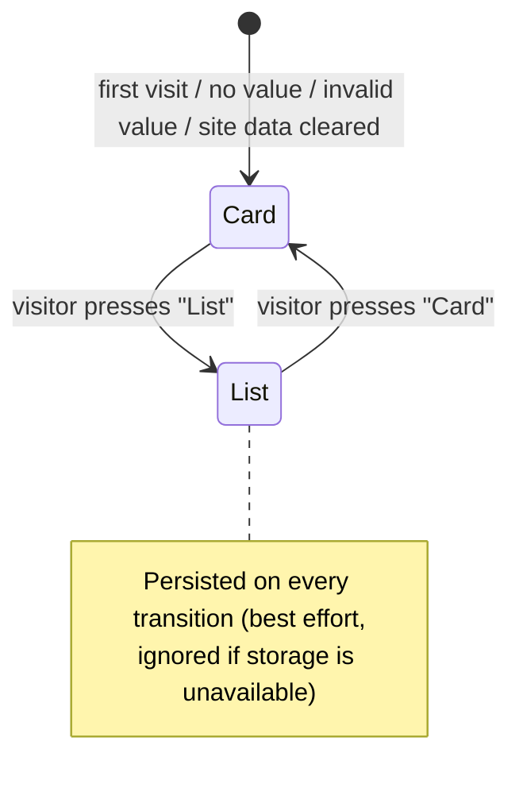

# Data Model: Episode List & Card (Grid) View Toggle

**Feature**: 002-episode-view-toggle | **Date**: 2026-10-07

This feature adds one piece of client-side state and reuses the existing `Episode` content
unchanged (see [001 data-model](../001-podcast-website/data-model.md)).

## Entities

### ViewPreference (client-side state)

| Field | Type | Rules |
|-------|------|-------|
| `episodeView` | `"card"` \| `"list"` | Stored in `localStorage` under key `episodeView`. Absent or any other value ⇒ treated as `"card"` (FR-006, FR-012). |

**Lifecycle / state transitions**

**Where it is reflected**

| Surface | Representation |
|---------|----------------|
| `<html>` | `data-view="card"` \| `data-view="list"`; attribute absent ⇒ Card styling applies |
| `ViewSwitcher` | `aria-pressed="true"` on the active option; live region text |
| CSS | `:global(html[data-view="list"])` overrides in `episodes/page.module.css` and `EpisodeCard.module.css` |

**Independence**: `episodeView` is independent of the `theme` preference; both are read by the
same inline bootstrap script but stored under separate keys and never influence each other.

### Episode (existing, unchanged)

List view consumes `number`, `title`, `slug`, `artworkSrc`, `artworkAlt`, `durationSeconds`,
`publishedAt`, and (≥ 960 px only) `shortDescription`. No fields added; `content/episodes.ts`
is not modified (FR-013).

## Validation strategy

- `ViewSwitcher.test.tsx` asserts the accept-list (`card`/`list`) and the invalid-value fallback.
- `content.test.ts` (existing) continues to guard the episode invariants; this feature must not
  change its results.
