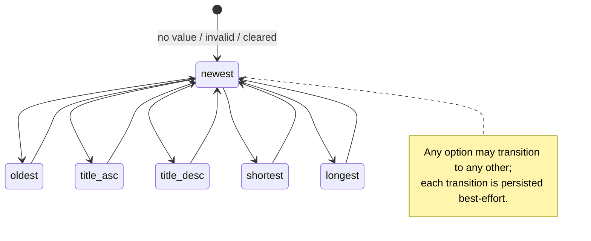

# Data Model: Episode Sorting

**Feature**: 003-episode-sorting | **Date**: 2026-10-07

Adds one client-side preference and one build-time derived structure. `Episode` content is
unchanged (see [001 data-model](../001-podcast-website/data-model.md)).

## Entities

### SortPreference (client-side state)

| Field | Type | Rules |
|-------|------|-------|
| `episodeSort` | `"newest"` \| `"oldest"` \| `"title-asc"` \| `"title-desc"` \| `"shortest"` \| `"longest"` | Stored in `localStorage` under key `episodeSort`. Absent or any other value ⇒ `"newest"` (FR-006, FR-011). Independent of `episodeView` and `theme` (FR-013). |

**Order semantics (FR-002, FR-003)**

| Value | Primary key | Direction | Comparison | Tie-break |
|-------|-------------|-----------|------------|-----------|
| `newest` | `publishedAt` | desc | ISO string | `number` desc |
| `oldest` | `publishedAt` | asc | ISO string | `number` desc |
| `title-asc` | `title` | asc | `Intl.Collator("en", { sensitivity: "base", numeric: true })` | `number` desc |
| `title-desc` | `title` | desc | same collator | `number` desc |
| `shortest` | `durationSeconds` | asc | numeric | `number` desc |
| `longest` | `durationSeconds` | desc | numeric | `number` desc |

**Lifecycle**

**Where it is reflected**

| Surface | Representation |
|---------|----------------|
| `<html>` | `data-sort="<value>"`; absent ⇒ newest (DOM order) |
| `SortControl` | `<select value>`; live region "Sorted by {label}" |
| CSS | `:global(html[data-sort="X"]) .grid > li { order: var(--s-X) }` for the five non-default values |
| DOM (post-hydration) | `<li>` children re-ordered by `EpisodeCatalog` to match |

### EpisodeRanks (build-time derived, immutable)

| Field | Type | Rules |
|-------|------|-------|
| key | `slug` | one entry per episode (20) |
| `oldest` | integer 0–19 | position under `oldest`; the set over all episodes is a permutation of 0..19 |
| `title-asc` | integer 0–19 | idem |
| `title-desc` | integer 0–19 | idem |
| `shortest` | integer 0–19 | idem |
| `longest` | integer 0–19 | idem |

Emitted as inline style on each `<li>`:
`--s-oldest`, `--s-title-asc`, `--s-title-desc`, `--s-shortest`, `--s-longest`.
`newest` has no variable (it is the DOM order).

### Episode (existing, unchanged)

Sorting reads `publishedAt`, `title`, `durationSeconds`, `number`, `slug`. The client receives a
card-only projection: `number, slug, title, shortDescription, artworkSrc, artworkAlt,
durationSeconds, publishedAt` (no `fullDescription`, no `audioSrc`, no `featured`).

## Validation strategy

- `sort.test.ts` proves each comparator's order on the real content, the tie-break, the
  collator behaviour, the accept-list, and that every rank column is a permutation of 0..19.
- `content.test.ts` (existing) still guards episode invariants; this feature must not change its
  results.
